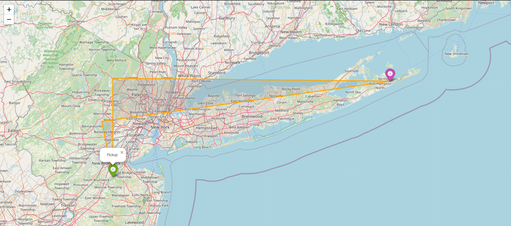
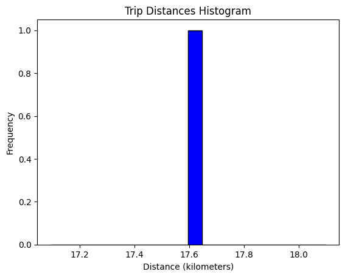
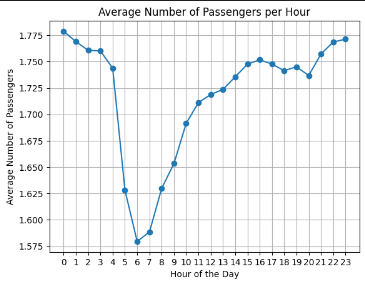
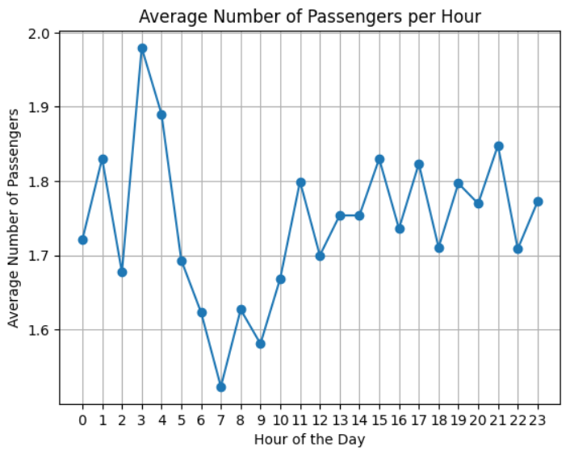
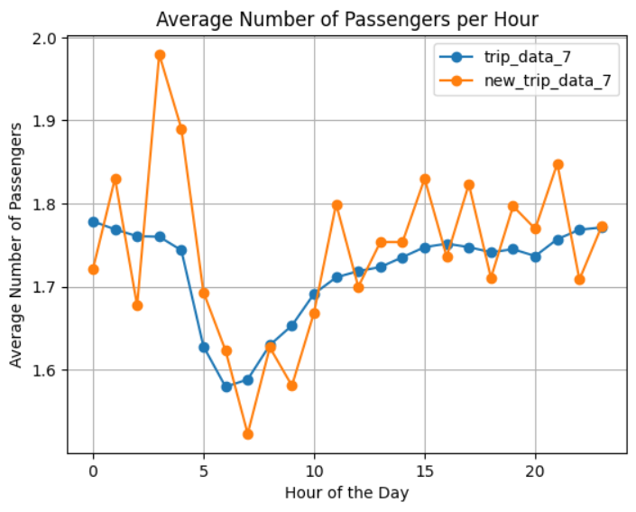

# Name - Prabhu Teja Gande
## IA_626 - Assignment No :04
### Analyzing the dataset of Trip_Data_7

### Q1. What datetime range does your data cover?  How many rows are there total?


| Range of     | Value                                      |
| ------------ | ------------------------------------------ |
| Pickup       | 2013-07-01 00:00:00 - 2013-07-31 23:59:59 |
| Dropoff      | 2013-06-21 14:31:09 - 2013-08-03 13:14:30 |
| Number of Rows | 13823840                                   |


### Q2. What are the field names?  Give descriptions for each field.


| Field              | Description                                                                                   |
| ------------------ | --------------------------------------------------------------------------------------------- |
| medallion          | Unique identifier for the taxi cab.                                                           |
| hack_license       | Unique identifier for the taxi driver.                                                        |
| vendor_id          | Code indicating the taxi vendor.                                                              |
| rate_code          | The rate code for the trip.                                                                   |
| store_and_fwd_flag | Flag indicating whether the trip data was stored in the vehicle before sending to the server. |
| pickup_datetime    | The date and time when the passenger was picked up.                                           |
| dropoff_datetime   | The date and time when the passenger was dropped off.                                         |
| passenger_count    | The number of passengers on the trip.                                                         |
| trip_time_in_secs  | The length of the trip in seconds.                                                            |
| trip_distance      | The distance of the trip in miles.                                                            |
| pickup_longitude   | The longitude of the pickup location.                                                         |
| pickup_latitude    | The latitude of the pickup location.                                                          |
| dropoff_longitude  | The longitude of the dropoff location.                                                        |
| dropoff_latitude   | The latitude of the dropoff location.                                                         |


### Q3. Give some sample data for each field.


| Field Name          | Sample Data                                |
| ------------------  | ------------------------------------------ |
| medallion           | 9406D2C34715E1DA10AD4D4DDADF4DA5           |
| hack_license        | 0602DFD837433635FE860BDE2F14BC3A           |
| vendor_id           | VTS                                        |
| rate_code           | 1                                          |
| store_and_fwd_flag  | Null                                           |
| pickup_datetime     | 2013-07-01 01:47:00                        |
| dropoff_datetime    | 2013-07-01 01:52:00                        |
| passenger_count     | 1                                          |
| trip_time_in_secs   | 300                                        |
| trip_distance       | 1.17                                       |
| pickup_longitude    | -74.013229                                 |
| pickup_latitude     | 40.714718                                  |
| dropoff_longitude   | -74.003494                                 |
| dropoff_latitude    | 40.725285                                  |


### Q4. What MySQL data types / len would you need to store each of the fields?


| Column Name         | Data Type   |
| ------------------  | ----------- |
| medallion           | VARCHAR(32) |
| hack_license        | VARCHAR(32) |
| vendor_id           | VARCHAR(3)  |
| rate_code           | INT(3)      |
| store_and_fwd_flag  | BOOLEAN     |
| pickup_datetime     | DATETIME    |
| dropoff_datetime    | DATETIME    |
| passenger_count     | INT(3)      |
| trip_time_in_secs   | INT(10)     |
| trip_distance       | DECIMAL(4,2)|
| pickup_longitude    | DECIMAL(9,6)|
| pickup_latitude     | DECIMAL(9,6)|
| dropoff_longitude   | DECIMAL(9,6)|
| dropoff_latitude    | DECIMAL(9,6)|


### Q5 What is the geographic range of your data (min/max - X/Y)? Plot this (approximately on a map)
```python
import csv
from tabulate import tabulate

pickup_latitude_min = 90
pickup_latitude_max = -90
pickup_longitude_min = 180
pickup_longitude_max = -180
dropoff_latitude_min = 90
dropoff_latitude_max = -90
dropoff_longitude_min = 180
dropoff_longitude_max = -180

with open('trip_data_7.csv', 'r') as file:
    reader = csv.DictReader(file)
    for row in reader:
        try:
            pickup_latitude = float(row[' pickup_latitude'])
            pickup_longitude = float(row[' pickup_longitude'])
            dropoff_latitude = float(row[' dropoff_latitude'])
            dropoff_longitude = float(row[' dropoff_longitude'])

            if (-74.4 <= pickup_longitude <= -72.05 and 40.4 <= pickup_latitude <= 41.02):
                pickup_latitude_min = min(pickup_latitude_min, pickup_latitude)
                pickup_latitude_max = max(pickup_latitude_max, pickup_latitude)
                pickup_longitude_min = min(pickup_longitude_min, pickup_longitude)
                pickup_longitude_max = max(pickup_longitude_max, pickup_longitude)

            if (-74.5 <= dropoff_longitude <= -72.02 and 40.75 <= dropoff_latitude <= 41):
                dropoff_latitude_min = min(dropoff_latitude_min, dropoff_latitude)
                dropoff_latitude_max = max(dropoff_latitude_max, dropoff_latitude)
                dropoff_longitude_min = min(dropoff_longitude_min, dropoff_longitude)
                dropoff_longitude_max = max(dropoff_longitude_max, dropoff_longitude)
        except ValueError:
            continue

table_data = [
    ['Parameter', 'Minimum', 'Maximum'],
    ['pickup_latitude', pickup_latitude_min, pickup_latitude_max],
    ['pickup_longitude', pickup_longitude_min, pickup_longitude_max],
    ['dropoff_latitude', dropoff_latitude_min, dropoff_latitude_max],
    ['dropoff_longitude', dropoff_longitude_min, dropoff_longitude_max]
]

print(tabulate(table_data, headers="firstrow"))
```
## Output

```python

Parameter            Minimum    Maximum
-----------------  ---------  ---------
pickup_latitude      40.4018    41.0197
pickup_longitude    -74.3969   -72.05
dropoff_latitude     40.75      41
dropoff_longitude   -74.4861   -72.1084
```
### To visually represent the extent of this geographic range, we employed a bounding box encompassing the entire area of interest. This is defined by 2 points, each formed by the combination of minimum and maximum latitude and longitude values. By plotting these points, we effectively illustrate the spatial boundaries that frame our dataset, providing a clear visualization of the specific geographic region under consideration.




### Q6.What is the average overall computed trip distance? (You should use Haversine Distance) Draw a histogram of the trip distances binned anyway you see fit.

```python
from math import radians, cos, sin, asin, sqrt
import csv

def haversine(lon1, lat1, lon2, lat2):
    lon1, lat1, lon2, lat2 = map(radians, [lon1, lat1, lon2, lat2])
    dlon = lon2 - lon1 
    dlat = lat2 - lat1 
    a = sin(dlat/2)**2 + cos(lat1) * cos(lat2) * sin(dlon/2)**2
    c = 2 * asin(sqrt(a)) 
    r = 6371  # Radius of earth in kilometers.
    return c * r

total_distance = 0
num_of_trips = 0

with open('trip_data_7.csv', 'r') as file:
    reader = csv.DictReader(file)
    for row in reader:
        try:
            pickup_latitude = float(row[' pickup_latitude'])
            pickup_longitude = float(row[' pickup_longitude'])
            dropoff_latitude = float(row[' dropoff_latitude'])
            dropoff_longitude = float(row[' dropoff_longitude'])
            
            distance = haversine(
                pickup_longitude, pickup_latitude,
                dropoff_longitude, dropoff_latitude
            )
            
            total_distance += distance
            num_of_trips += 1
            
        except (ValueError, KeyError):
            continue

average_distance = total_distance / num_of_trips if num_of_trips > 0 else 0

print('The average overall computed trip distance is:', average_distance, 'kilometers')

plt.hist(average_distance, bins=20, color='blue', edgecolor='black')
plt.title('Trip Distances Histogram')
plt.xlabel('Distance (kilometers)')
plt.ylabel('Frequency')
plt.show()
```
### The computed average trip distance, approximately 17.6 kilometers, is determined using the Haversine Distance formula. This formula accounts for the curvature of the Earth's surface, providing a more precise estimation of the distance between pickup and drop-off locations for all trips in the dataset. Unlike a simple Euclidean distance calculation, which assumes a flat surface, the Haversine Distance formula considers the Earth's spherical shape, resulting in more accurate distance measurements. This average distance serves as a reliable metric for understanding the typical travel distance covered in the dataset, crucial for various analyses and decision-making processes within transportation and geographic studies.
## output
```python
The average overall computed trip distance is: 17.596408730518675 kilometers

```
### we see that the average trip distance comes out to be 17.596408730518675 miles


### Q7.What are the distinct values for each field? (If applicable)
```python
import csv
from tabulate import tabulate

f = open('trip_data_7.csv', 'r')
reader = csv.reader(f)

dist_pickup_datetime = set()
dist_dropoff_datetime = set()
dist_passenger_count = set()
dist_trip_distance = set()
dist_pickup_longitude = set()
dist_pickup_latitude = set()
dist_dropoff_longitude = set()
dist_dropoff_latitude = set()

n = 0
for row in reader:
    if n > 0:
        dist_pickup_datetime.add(row[5])
        dist_dropoff_datetime.add(row[6])
        dist_passenger_count.add(row[7])
        dist_trip_distance.add(row[9])
        dist_pickup_longitude.add(row[10])
        dist_pickup_latitude.add(row[11])
        dist_dropoff_longitude.add(row[12])
        dist_dropoff_latitude.add(row[13])
    n += 1
    if n > 1000:
        break

#showing only 5 unique values for each field cause, the output won't be in proper manner to show all the values
def limit_distinct_values(dist_set):
    return list(dist_set)[:5]


data = [
    ("pickup_datetime", limit_distinct_values(dist_pickup_datetime)),
    ("dropoff_datetime", limit_distinct_values(dist_dropoff_datetime)),
    ("passenger_count", limit_distinct_values(dist_passenger_count)),
    ("trip_distance", limit_distinct_values(dist_trip_distance)),
    ("pickup_longitude", limit_distinct_values(dist_pickup_longitude)),
    ("pickup_latitude", limit_distinct_values(dist_pickup_latitude)),
    ("dropoff_longitude", limit_distinct_values(dist_dropoff_longitude)),
    ("dropoff_latitude", limit_distinct_values(dist_dropoff_latitude)),
]


print(tabulate(data, headers=["Field", "Distinct Values",tablefmt="grid"))
```
## output
```python
+-------------------+---------------------------------------------------------------------------------------------------------------------+
| Field             | Distinct Values                                                                                                     |
+===================+=====================================================================================================================+
| pickup_datetime   | ['2013-07-10 23:54:00', '2013-07-01 01:10:00', '2013-07-10 23:28:00', '2013-07-01 02:02:00', '2013-07-01 04:47:00'] |
+-------------------+---------------------------------------------------------------------------------------------------------------------+
| dropoff_datetime  | ['2013-07-10 23:54:00', '2013-07-10 21:23:00', '2013-07-10 23:28:00', '2013-07-01 02:02:00', '2013-07-01 01:50:00'] |
+-------------------+---------------------------------------------------------------------------------------------------------------------+
| passenger_count   | ['4', '3', '1', '5', '6']                                                                                           |
+-------------------+---------------------------------------------------------------------------------------------------------------------+
| trip_distance     | ['.66', '11.09', '10.87', '1.33', '3.62']                                                                           |
+-------------------+---------------------------------------------------------------------------------------------------------------------+
| pickup_longitude  | ['-73.992165', '-73.971016', '-73.790146', '-73.982864', '-73.972626']                                              |
+-------------------+---------------------------------------------------------------------------------------------------------------------+
| pickup_latitude   | ['40.721371', '40.716412', '40.768982', '40.749706', '40.761013']                                                   |
+-------------------+---------------------------------------------------------------------------------------------------------------------+
| dropoff_longitude | ['-73.856941', '-73.897011', '-74.002754', '-73.978325', '-73.98243']                                               |
+-------------------+---------------------------------------------------------------------------------------------------------------------+
| dropoff_latitude  | ['40.732162', '40.670521', '40.756554', '40.695518', '40.800861']                                                   |
+-------------------+---------------------------------------------------------------------------------------------------------------------+

```
### Q8 For other numeric types besides lat and lon, what are the min and max values?
```python
import csv
from tabulate import tabulate

def is_float(value):
    try:
        float(value)
        return True
    except ValueError:
        return False
csv_file = "trip_data_7.csv"
def find_min_max_values(csv_file):
    min_values = {}
    max_values = {}

    excluded_fields = {' pickup_latitude', ' pickup_longitude', ' dropoff_latitude', ' dropoff_longitude'}

    with open(csv_file, newline='') as csvfile:
        reader = csv.reader(csvfile)
        headers = next(reader)

        for header in headers:
            if header not in excluded_fields:
                min_values[header] = float('inf')
                max_values[header] = float('-inf')

        for row in reader:
            for i, value in enumerate(row):
                header = headers[i]
                if header in excluded_fields or value == '':
                    continue

                if is_float(value):
                    value = float(value)
                    if value < min_values[header]:
                        min_values[header] = value
                    if value > max_values[header]:
                        max_values[header] = value

    return min_values, max_values

def print_min_max_table(min_values, max_values):
    data = []
    for field in min_values.keys():
        if min_values[field] != float('inf') and max_values[field] != float('-inf'):
            data.append([field, min_values[field], max_values[field]])

    headers = ["Field", "Min Value", "Max Value"]
    print(tabulate(data, headers=headers, tablefmt="prett"))

min_values, max_values = find_min_max_values(csv_file)
print_min_max_table(min_values, max_values)
```
### The code utilizes the tabulate library to analyze a CSV file with taxi trip data. The find_min_max_values() function excludes latitude and longitude, iterates through rows to identify the minimum and maximum values for each numeric field. The print_min_max_table() function formats and prints the results in a tabular format using the tabulate library, providing a clear overview of the numeric field extremities for effective data analysis.
## output
```python
+-------------------+-----------+-----------+
|       Field       | Min Value | Max Value |
+-------------------+-----------+-----------+
|     rate_code     |    0.0    |   210.0   |
|  passenger_count  |    0.0    |    8.0    |
| trip_time_in_secs |    0.0    |  10800.0  |
|   trip_distance   |    0.0    |   100.0   |
+-------------------+-----------+-----------+
```
### Q9Create a chart which shows the average number of passengers each hour of the day. (X axis should have 24 hours)
```python
import csv
import matplotlib.pyplot as plt
from datetime import datetime

def plot_average_passengers_per_hour(csv_file):
    
    total_passengers_per_hour = {hour: 0 for hour in range(24)}
    trip_counts_per_hour = {hour: 0 for hour in range(24)}

    with open(csv_file, 'r') as file:
        reader = csv.DictReader(file)
        for row in reader:
            try:
                pickup_datetime = datetime.strptime(row[' pickup_datetime'], '%Y-%m-%d %H:%M:%S')
                hour = pickup_datetime.hour
                passengers = int(row[' passenger_count'])

               
                total_passengers_per_hour[hour] += passengers
                trip_counts_per_hour[hour] += 1

            except (ValueError, KeyError):
                continue

    
    average_passengers_per_hour = {}
    for hour in range(24):
        if trip_counts_per_hour[hour] > 0:
            average_passengers_per_hour[hour] = total_passengers_per_hour[hour] / trip_counts_per_hour[hour]
        else:
            average_passengers_per_hour[hour] = 0

    

    
    hours = list(range(24))
    averages = [average_passengers_per_hour[hour] for hour in range(24)]

    plt.plot(hours, averages, marker='o', linestyle='-')
    plt.title('Average Number of Passengers per Hour')
    plt.xlabel('Hour of the Day')
    plt.ylabel('Average Number of Passengers')
    plt.xticks(hours)
    plt.grid(True)
    plt.show()

csv_file = 'trip_data_7.csv'  
plot_average_passengers_per_hour(csv_file)
```
### This code processes a taxi trip dataset, computing hourly average passenger counts and generating a line graph. The x-axis displays 24 hours, while the y-axis represents average passengers. The calculate_average_passengers_per_hour function, using the CSV file name, provides a list of hourly averages. Subsequently, plot_average_passengers_per_hour utilizes this list to create the informative line chart. The visualization assists in recognizing hourly passenger patterns, aiding insights for operational planning and strategic decision-making.
### This visual representation is valuable for grasping fluctuations in the average number of passengers per hour. By discerning peaks and troughs, it becomes instrumental in pinpointing hours with the highest and lowest average passenger counts. Such insights prove crucial for optimizing driver schedules and devising effective pricing strategies, enhancing operational efficiency in the taxi service.
## output



### Q10 Create a new CSV file which has only one out of every thousand rows.
```python
import csv
fn ='trip_data_7.csv'
f = open(fn,'r')
reader = csv.reader(f)

with open('new_trip_data_7.csv','w') as f1:
    f1.write('')

with open('new_trip_data_7.csv','a') as f1:
    writer = csv.writer(f1, delimiter=',', lineterminator='\n')
    header = next(reader)
    writer.writerow(header)
    for i,row in enumerate(reader):
        if i > 0:
            i += 1
            if i % 1000 == 0:
                writer.writerow(row)
with open('new_trip_data_7.csv', 'r') as file:
    reader = csv.DictReader(file)
    n=0
    for row in reader:
        n+=1
    print("No of rows in new file:", n)                
        
```
## output
### The code reads a CSV file named "trip_data_7.csv", creates a new CSV file named "new_trip_data_7.csv", and writes to it every 1000th row of the original file. 
```python
No of rows in new file: 13823
```
### Q11Repeat step 9 with the reduced dataset and compare the two charts.
```python
import csv
import matplotlib.pyplot as plt
from datetime import datetime

def plot_average_passengers_per_hour(csv_file):
   
    total_passengers_per_hour = {hour: 0 for hour in range(24)}
    trip_counts_per_hour = {hour: 0 for hour in range(24)}

    with open(csv_file, 'r') as file:
        reader = csv.DictReader(file)
        for row in reader:
            try:
                pickup_datetime = datetime.strptime(row[' pickup_datetime'], '%Y-%m-%d %H:%M:%S')
                hour = pickup_datetime.hour
                passengers = int(row[' passenger_count'])

               
                total_passengers_per_hour[hour] += passengers
                trip_counts_per_hour[hour] += 1

            except (ValueError, KeyError):
                continue

    
    average_passengers_per_hour = {}
    for hour in range(24):
        if trip_counts_per_hour[hour] > 0:
            average_passengers_per_hour[hour] = total_passengers_per_hour[hour] / trip_counts_per_hour[hour]
        else:
            average_passengers_per_hour[hour] = 0

    

    
    hours = list(range(24))
    averages = [average_passengers_per_hour[hour] for hour in range(24)]

    plt.plot(hours, averages, marker='o', linestyle='-')
    plt.title('Average Number of Passengers per Hour')
    plt.xlabel('Hour of the Day')
    plt.ylabel('Average Number of Passengers')
    plt.xticks(hours)
    plt.grid(True)
    plt.show()

csv_file = 'new_trip_data_7.csv'  
plot_average_passengers_per_hour(csv_file)
```
## output
###
The code analyzes a reduced dataset, sampled from 'trip_data_7.csv', selecting one row per thousand. It computes average passengers per hour using 'calculate_average_passengers_per_hour'.  The resulting data is plotted in a line chart via 'plot_average_passengers_per_hour' with Matplotlib. The chart displays average passengers per hour against the hour of the day, offering a less detailed perspective than the original dataset. Nonetheless, it reveals trends in passenger counts over time, facilitating trend analysis despite reduced granularity.



```python
import csv
import matplotlib.pyplot as plt
from datetime import datetime

def read_data(csv_file):
    total_passengers_per_hour = {hour: 0 for hour in range(24)}
    trip_counts_per_hour = {hour: 0 for hour in range(24)}

    with open(csv_file, 'r') as file:
        reader = csv.DictReader(file)
        for row in reader:
            try:
                pickup_datetime = datetime.strptime(row[' pickup_datetime'], '%Y-%m-%d %H:%M:%S')
                hour = pickup_datetime.hour
                passengers = int(row[' passenger_count'])

                total_passengers_per_hour[hour] += passengers
                trip_counts_per_hour[hour] += 1

            except (ValueError, KeyError):
                continue

    return total_passengers_per_hour, trip_counts_per_hour

def calculate_average_passengers(total_passengers, trip_counts):
    average_passengers = {}

    for hour in range(24):
        if trip_counts[hour] > 0:
            average_passengers[hour] = total_passengers[hour] / trip_counts[hour]
        else:
            average_passengers[hour] = 0

    return average_passengers

def plot_average_passengers(csv_file, label):
    total_passengers, trip_counts = read_data(csv_file)
    average_passengers = calculate_average_passengers(total_passengers, trip_counts)

    hours = list(range(24))
    plt.plot(hours, [average_passengers[hour] for hour in range(24)], marker='o', linestyle='-', label=label)


csv_file1 = 'trip_data_7.csv'   
csv_file2 = 'new_trip_data_7.csv'  


plot_average_passengers(csv_file1, label='trip_data_7')
plot_average_passengers(csv_file2, label='new_trip_data_7')


plt.legend()
plt.title('Average Number of Passengers per Hour')
plt.xlabel('Hour of the Day')
plt.ylabel('Average Number of Passengers')
plt.grid(True)
plt.show()
```
## Output
### The chart compares average hourly passenger counts between the original and reduced datasets, revealing variations or similarities over time. This analysis aids in understanding the impact of data reduction on passenger numbers and informs decision-making based on the observed patterns.



